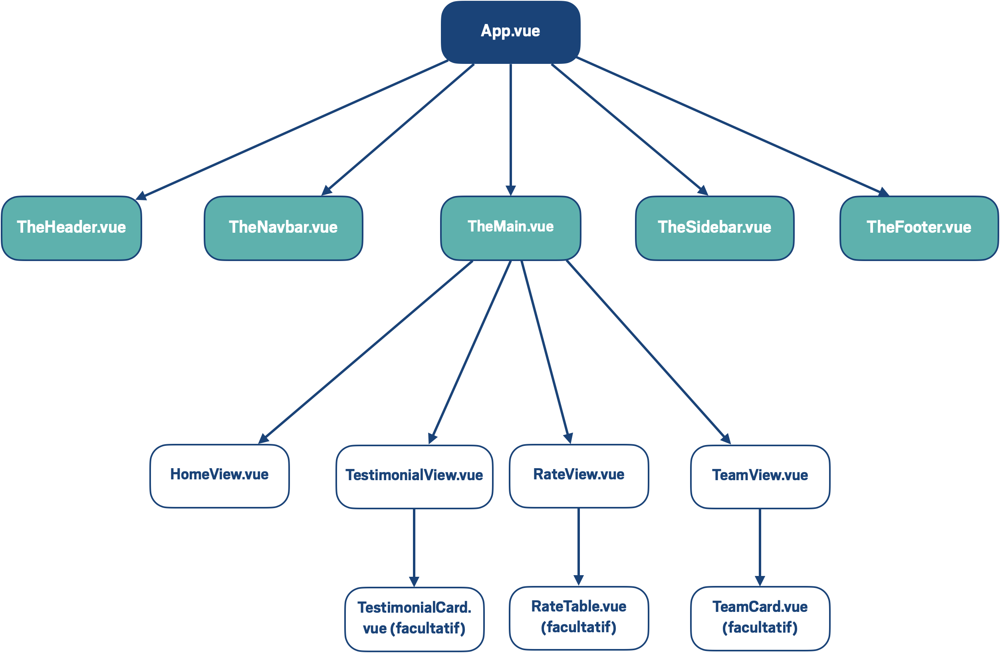

# static-nav-vue

A partir d'un site static contenant des fichiers html et css, le but de ce projet était de le transformer en un projet Vue.js.

Cett branche ajoute la barre de navigation fonctionnelle avec des props et des emits

## Schéma de l'organisation du projet

## vidéo sur la partie de la barre de navigation (§avec des props et des emits)

[Lien vers la video](https://app.screencast.com/u30G5osqRP1bw)
